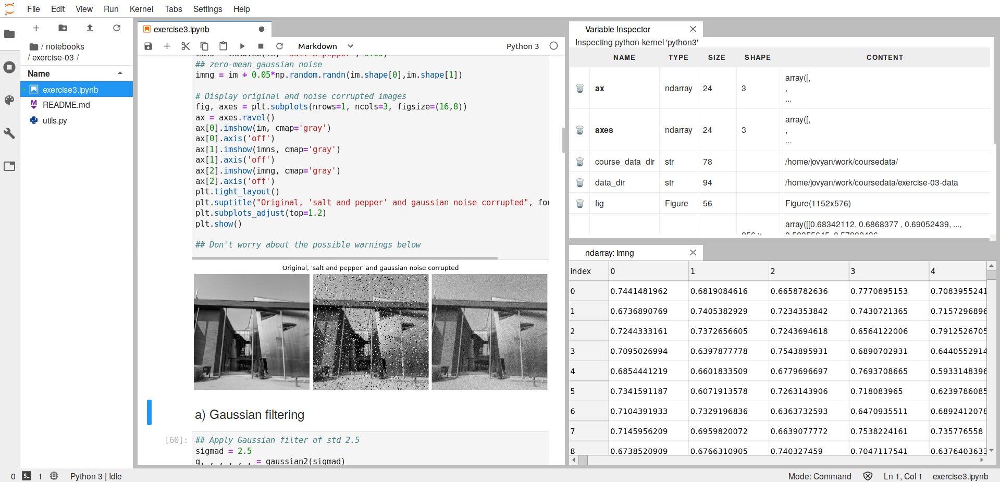

# CS-E4850 Computer Vision Course 2022 - Python assignments

This repository contains the Jupyter notebooks and related files used in the Python programming exercises for the [CS-E4850 - Computer Vision course 2022](https://mycourses.aalto.fi/course/view.php?id=37056) at Aalto University, including (1) the actual weekly homework assignments and (2) all test images. Please, see the notebooks for more details on, e.g., submission guideline. If you need to clone this repository read the instructions in option 2 (personal Docker container) on how to clone and update a repository containing [Git submodules](https://git-scm.com/book/en/v2/Git-Tools-Submodules).

For more information, or bug reporting, feel free to contact Xiaotian Li at the standard Aalto email.

## Instructions on how to work on the assignments

### 1. Aalto JupyterHub (Recommended option)

We have added the course to Aalto JupyterHub which you can access here: [Aalto JupyterHub](https://jupyter.cs.aalto.fi). JupyterHub detailed instructions:
1. Select the Computer Vision course and click Spawn.
2. Select the Assignments tab and click Fetch on the visible assignments. Once new assignments are released, you have to fetch them here.
3. The assignments are now visible under your Files tab (you might have to wait a moment for them to appear and/or click refresh). You can start working on the assignments by opening a Jupyter Notebook by clicking the .ipynb file inside the exercise folder.
4. JupyterLab is also available and we have added a useful [variable inspector extension](https://github.com/lckr/jupyterlab-variableInspector) to help you out. You can switch to JupyterLab by adding "lab/" option to your URL:
  * change ...jupyter.cs.aalto.fi/user/your_username/tree/notebooks?
  * to ...jupyter.cs.aalto.fi/user/your_username/lab/tree/notebooks?.
  * Activate the variable inspector extension by opening a Notebook, right-click with your mouse and choose "Open Variable Inspector." You can then drag the inspector to one side of the screen. NB: The extension is still experimental and might not work perfectly. If you experience serious problems, for example, performance issues, kindly report them through MyCourses Forums or at the exercise sessions.
5. More information on, for example, how to access your JupyterHub data and JupyterHub, in general, can be found [here](https://scicomp.aalto.fi/aalto/jupyterhub.html).
6. When you're ready to submit your solution, export the assignment to pdf and Jupyter Notebook format (.ipynb) and submit them both, the pdf and the Notebook, through MyCourses.
7. If you accidentally select a wrong environment or if you use JupyterHub for another course and the wrong environment persists, click "Control Panel" in the upper right corner, select "Stop My Server" and start from the beginning.

Your JupyterLab environment should look approximately like this:

### 2. Docker

This option will result in the same environment as option 1 above, but you'll now also be able to work on the assignments offline. If you have a basic understanding of Git and Docker, this is an option.

1. Download [Docker](https://www.docker.com/).
2. Clone this repo and update the submodules using the following commands:
  * `git clone --recurse-submodules https://github.com/AaltoVision/CV-course-py`
  * `cd CV-course-py`
  * `git submodule update --remote`
3. Once new assignments are released, you can pull them using:
  * `git submodule update --remote`
4. NB: Remember to use the above commands and not, for example, `git pull`. This repo uses [Git submodules](https://git-scm.com/book/en/v2/Git-Tools-Submodules) that collect the separated repositories, notebooks and data, into this single repository, so you don't have to update and clone two repositories. They are separated because it's more convenient for managing JupyterHub.
5. Download the Docker image. Note: the compressed filesize is about 4GB.
  * `docker pull apparvi/cv2020`
6. Inside the folder CV-course-py that you cloned create a  Docker container by running this bit of a monster command. The command is explained [here](https://hub.docker.com/r/apparvi/cv2020):
  * `docker run -it --name cvcourse --user $(id -u):$(id -g) --group-add users -v "$(pwd)":/home/jovyan/work -p 8888:8888 apparvi/cv2020 start.sh jupyter lab --NotebookApp.custom_display_url='http://127.0.0.1:8888' --notebook-dir=/home/jovyan/work`
7. To start JupyterLab copy & paste the created URL to your browser.
8. In the future start the container with a more simple command by calling its name:
  * `docker start -i cvcourse`
9. When you're ready to submit your solution, export the assignment to pdf and Jupyter Notebook format (.ipynb) and submit them both, the pdf and the Notebook, through MyCourses.
